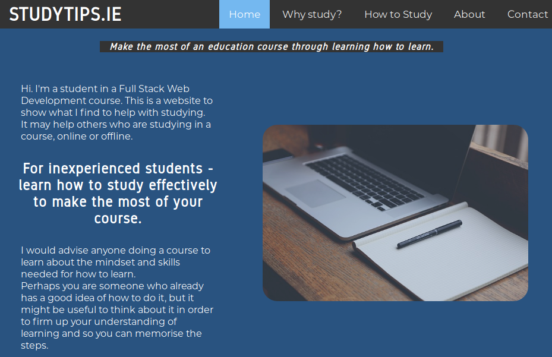

# Study Tips Guide website

This is a website to help students to make the most of an education course through learning how to learn. It includes an introduction page, a guide on why to study, a guide on how to study, an about page, and a contact form.

## Demo

There is a live demo available [here](https://evmcodi.github.io/UserCentricDesignMilestoneProject1/index.html)




## UX


### User Stories

- As a student, I want to find resources for learning study skills in a clearly laid out guide with some images, so I can obtain this knowledge and apply this information in my courses.

### Strategy
The goal for the UX design of this site was to make it easy and intuitive for students to view information and advice on any device: a phone, tablet or desktop screen.

### Scope
I wanted to give students an understanding of why studying is important within an online course, how best to study, and how to be engaged with the site as it would be updated in the future.

### Structure

StudyTips is laid out in a way that steps through the pages linked in the header bar in a chronological way. The landing page is 'Home' where a student can learn about the purpose of the website. 

The next page is 'Why study?' to give reasons to the student to work at their course. The 'How to study' page then gives practical hints to the student on ways to improve study.
Following this there is an about page for a visitor wondering when the page was created and by who. Then for communication links the contact page is the final page in the header.

On both mobile and desktop there are useful 'page turning' buttons at the bottom of each page, as well as a top navigation bar, that allows for intuitive progress through the site.

I chose to make the site 'mobile-first' and responsive so that page loading would be quicker on less powerful, small devices.


### Skeleton
There is a wireframe available to view at https://evmcodi.github.io/UserCentricDesignMilestoneProject1/studytips-wireframe.html. 

### Surface

I chose dark blue and grey colour scheme to create a calm but engaging feel.

## Technologies Used

- HTML
- CSS
- Javascript

I didn't use a frontend framework for this project. I used one javascript function to enable a dropdown menu.

## Features
The site uses page turning navigation bar at the bottom of each page to create the feeling of page turning of a physical book.

The top header is sticky on desktop screens and non-sticky on mobile to save mobile screen space.

A CSS animation has been added to fade in the main content of each page in 400ms and fade in the images in 700ms to add to the feeling of turning a page in a physical book.

### Features Left to Implement
In the future I would like to add a 'Blog' page so that visitors to the site could keep up to date with news about the subject and the site.


## Devlopment tools used

### VSCode

- Free IDE developed by Microsoft.

### Live server extension for VSCode 
- Auto-reloads the site preview in the browser after a file is edited and saved. 
- Also allows viewing and testing your site on other devices connected to the same local network.
- https://github.com/ritwickdey/vscode-live-server

### Beautify css/sass/scss/less
- Extension for VSCode that allows instant formatting of CSS files with Ctrl-Shift-I shortcut.

### Firefox & Developer Tools
- Browser with developer tools for previewing UI.

### Git & Github
- Git is used for version control of code is preinstalled on most Linux distributions. 
- Github.com is used for storing version-controlled code online and as a cloud backup.

### Github Pages
- Github Pages is used for deployment of the code online.

### quickMockup
- https://jdittrich.github.io/quickMockup/

- Free open sourece tool for wireframing websites. Allows export to html.


## Testing
The student user story is achieved as the site is easy to navigate and follows logical progression through the pages.

On the Contact page, the form will not submit if you do not input a valid email address, as the form uses html input validation.

All page links have been tested manually in order to ensure that they navigate the user to the intended destination.

After clicking on a link to a new page a CSS animation has been tested to ensure it fades in the main content of the page in 400ms and fades in the images in 700ms.

The site was tested on multiple devices to ensure consistent and working deployment of the UX. These include a Linux desktop with Firefox, a Windows 10 laptop with Chrome, a Sony Xperia with Firefox and a Google Nexus table with Chrome.


## Deployment

StudyTips is hosted on Github pages. 

There was an issue with the relative links of the fonts and the favicon files when the site was uploaded to Github, which resulted in a 404 http error being shown in Firefox Developer Tools for each of these files. In order to fix this deployment issue a change in the linking was added with the addition of "../../" before the assets folder link.

### Cloning and editing

This site can be cloned with ```git clone``` and the files can be edited directly and viewed in a browser.

## Credits

### Content

All content in the pages of this site were written by me.


### Media
 Images from Free-Photos on Pixabay
 https://pixabay.com/photos/


Fonts from 
https://fontlibrary.org/


Favicon generator from:
https://favicon.io/


### Acknowledgements
Responsive top navigation bar with dropdown menu based on code from https://www.w3schools.com/howto/howto_js_topnav_responsive.asp


Responsive contact form based on edited code from 
https://www.w3schools.com/howto/howto_css_responsive_form.asp


<br><br>
*This site is not intended for commercial use*
